# ZeroTrust Framework

A production-ready, generic **zero-trust cryptographic protocol framework** for building verifiable peer-to-peer applications. The framework provides complete cryptographic guarantees without requiring trust in any participant.

**Use it for games, voting systems, auctions, smart contracts, or any P2P protocol requiring cryptographic verification.**

---

## 🎯 What Is This?

A complete framework providing:
- **Zero-knowledge proofs** - Prove facts without revealing data (Merkle trees)
- **Digital signatures** - Authenticate all actions (ECDSA)
- **Synchronized blockchain** - Immutable shared history ✅ **WORKING**
- **Cheat detection** - Detect & invalidate cheaters ✅ **WORKING**
- **Commitment schemes** - Cryptographically bind to state
- **Complete verification** - Anyone can independently audit
- **Protocol enforcement** - Automatic timeout and turn order enforcement ✅ **WORKING**
- **State persistence** - Save/load protocol state ✅ **WORKING**
- **Reconnection handling** - Automatic state recovery ✅ **WORKING**
- **Continuous monitoring** - Background violation detection ✅ **WORKING**

### Zero-Trust Properties

- ✅ **No trust in opponent** - All claims cryptographically verified
- ✅ **No trust in network** - All messages digitally signed
- ✅ **No central authority** - Pure P2P, fully decentralized
- ✅ **Zero-knowledge** - Reveal only what's necessary
- ✅ **Independently verifiable** - Third-party auditing possible
- ✅ **Cheat detection** - Cheaters automatically invalidated with proof
- ✅ **Automatic enforcement** - Timeouts and violations handled automatically

---

## 🚀 Quick Start

### Installation

```bash
# Install from PyPI (recommended)
pip install zerotrust-framework

# Or from source (development)
git clone https://github.com/Silenttttttt/zerotrust
cd zerotrust
pip install -e .
```

### Basic Usage

```python
from zerotrust import ZeroTrustProtocol, GridCommitment

# 1. Create your commitment to hidden state
commitment = GridCommitment(
    marked_positions=[(0, 0), (0, 1), (0, 2)],
    seed=secret_seed,
    grid_size=10
)

# 2. Initialize the framework with enforcement and persistence
protocol = ZeroTrustProtocol(
    my_commitment_data=marked_positions,
    seed=secret_seed,
    enable_enforcement=True,    # Automatic timeout/turn enforcement
    enable_persistence=True,    # Auto-save state
    enable_monitoring=True      # Background violation detection
)

# 3. Exchange commitments with opponent
my_commitment = protocol.get_my_commitment()
# Send my_commitment to opponent, receive theirs
protocol.set_opponent_commitment(opponent_commitment)

# 4. Record actions (framework signs automatically)
success, action_data, signature = protocol.record_my_action(
    action_type="my_action",
    data={"x": 0, "y": 0}
)

# 5. Verify opponent's actions (framework verifies signature)
result = protocol.verify_opponent_action(action_data, signature)
if result.valid:
    print("✓ Opponent's action verified")

# 6. Generate zero-knowledge proofs
proof, proof_sig = protocol.generate_proof(
    commitment_obj=commitment,
    query=(0, 0)
)

# 7. Verify opponent's proofs
result = protocol.verify_proof(proof, proof_sig, opponent_commitment_root)
if result.valid:
    print("✓ Proof verified")

# 8. Verify entire protocol execution
result = protocol.replay_from_blockchain()
if result.valid:
    print("✓ Complete history verified - no cheating detected")
```

---

## 🏗️ Architecture


### Framework Structure

The framework is **completely generic** - no application-specific code. Applications use the framework but don't implement crypto themselves.

```
zerotrust/
├── protocol.py          # Main ZeroTrustProtocol class
├── commitment.py        # Generic commitment interface
├── blockchain.py        # Generic blockchain
├── identity.py          # Cryptographic identity
├── merkle.py            # Merkle trees & ZK proofs
├── cheating.py          # Cheat detection & invalidation
├── enforcement.py       # Protocol enforcement
├── state_manager.py     # State persistence
└── reconnection.py      # Reconnection handling
```

---

## 🔐 How It Works

```mermaid
sequenceDiagram
    participant Alice
    participant Framework
    participant Blockchain
    participant Bob
    
    Note over Alice,Bob: Phase 1: Setup
    Alice->>Framework: Commit to state (Merkle root)
    Bob->>Framework: Commit to state (Merkle root)
    Framework->>Blockchain: Record commitments
    
    Note over Alice,Bob: Phase 2: Action
    Alice->>Framework: Perform action (e.g., fire shot)
    Framework->>Framework: Sign action (ECDSA)
    Framework->>Framework: Check turn order
    Framework->>Blockchain: Record signed action
    Framework->>Bob: Send action + signature
    
    Note over Alice,Bob: Phase 3: Response
    Bob->>Framework: Verify signature
    Framework->>Framework: ✓ Signature valid
    Bob->>Framework: Generate ZK proof (Merkle)
    Framework->>Framework: Sign proof
    Framework->>Blockchain: Record proof
    Framework->>Alice: Send proof + signature
    
    Note over Alice,Bob: Phase 4: Verification
    Alice->>Framework: Verify proof + signature
    Framework->>Framework: ✓ Proof valid, ✓ Signature valid
    Framework->>Blockchain: Record verification
    
    Note over Alice,Bob: Phase 5: Enforcement
    Framework->>Framework: Monitor for violations
    Framework->>Framework: Detect timeout/turn violation
    Framework->>Framework: Auto-invalidate cheater
    
    Note over Alice,Bob: Phase 6: Audit
    Alice->>Framework: Replay entire history
    Framework->>Blockchain: Verify all blocks
    Framework->>Framework: Verify all signatures
    Framework->>Framework: Verify all proofs
    Framework->>Alice: ✓ Everything verified
```



---

## 💻 Usage

### Using the Framework

```python
from zerotrust import ZeroTrustProtocol, GridCommitment

# 1. Create your commitment to hidden state
commitment = GridCommitment(
    marked_positions=[(0, 0), (0, 1), (0, 2)],
    seed=secret_seed,
    grid_size=10
)

# 2. Initialize the framework
protocol = ZeroTrustProtocol(
    my_commitment_data=marked_positions,
    seed=secret_seed,
    enable_enforcement=True,    # Enable automatic enforcement
    enable_persistence=True,    # Enable state persistence
    enable_monitoring=True      # Enable background monitoring
)

# 3. Exchange commitments with opponent
my_commitment = protocol.get_my_commitment()
# Send my_commitment to opponent, receive theirs
protocol.set_opponent_commitment(opponent_commitment)

# 4. Record actions (framework signs automatically)
success, action_data, signature = protocol.record_my_action(
    action_type="my_action",
    data={"x": 0, "y": 0}
)

# 5. Verify opponent's actions (framework verifies signature)
result = protocol.verify_opponent_action(action_data, signature)
if result.valid:
    print("✓ Opponent's action verified")

# 6. Generate zero-knowledge proofs
proof, proof_sig = protocol.generate_proof(commitment, query=(0, 0))

# 7. Verify opponent's proofs
result = protocol.verify_proof(proof, proof_sig, opponent_commitment_root)

# 8. Verify entire protocol execution
result = protocol.replay_from_blockchain()
if result.valid:
    print("✓ Complete history verified - no cheating detected")
```

### Example: Complete Game Flow

```python
from zerotrust import ZeroTrustProtocol, GridCommitment

# Create players
alice_commitment = GridCommitment(
    marked_positions=[(0, 0), (0, 1)],
    seed=alice_seed,
    grid_size=10
)

bob_commitment = GridCommitment(
    marked_positions=[(9, 9)],
    seed=bob_seed,
    grid_size=10
)

# Initialize protocols
alice = ZeroTrustProtocol(
    my_commitment_data=[(0, 0), (0, 1)],
    seed=alice_seed,
    enable_enforcement=True,
    enable_persistence=True
)

bob = ZeroTrustProtocol(
    my_commitment_data=[(9, 9)],
    seed=bob_seed,
    enable_enforcement=True,
    enable_persistence=True
)

# Exchange commitments (framework verifies)
alice.set_opponent_commitment(bob.get_my_commitment())
bob.set_opponent_commitment(alice.get_my_commitment())

# Alice fires (framework signs)
success, action_data, signature = alice.record_my_action(
    action_type="fire_shot",
    data={"x": 9, "y": 9}
)

# Bob verifies and responds (framework verifies signature & generates proof)
result = bob.verify_opponent_action(action_data, signature)
if result.valid:
    proof, proof_sig = bob.generate_proof(bob_commitment, query=(9, 9))
    bob.record_my_action(
        action_type="shot_result",
        data={"hit": True, "proof": proof}
    )

# Alice verifies result (framework verifies proof)
# ... verification code ...

# Independent verification (anyone can do this)
result = alice.replay_from_blockchain()
print(f"Game verified: {result.valid}")
```

### Enforcement Example

```python
from zerotrust import ZeroTrustProtocol

protocol = ZeroTrustProtocol(
    my_commitment_data=data,
    enable_enforcement=True  # Enable automatic enforcement
)

# Start monitoring (runs in background)
protocol.start_monitoring(interval=1.0)

# Timeouts are automatically detected
# Turn order is automatically enforced
# Violations are automatically handled

# Set turn order
protocol.enforcement.set_turn("alice")
protocol.enforcement.set_turn("bob")

# Start action with timeout
protocol.enforcement.start_action_with_timeout("shot_response", timeout=30.0)

# If timeout occurs, violation is automatically detected and handled
# If turn violation occurs, action is rejected and cheater is invalidated
```

### State Persistence Example

```python
from zerotrust import ZeroTrustProtocol

protocol = ZeroTrustProtocol(
    my_commitment_data=data,
    enable_persistence=True,
    save_path="game_state.json"
)

# State is automatically saved periodically
# Or manually save
protocol.state_manager.save_state()

# Load state (e.g., after restart)
protocol.state_manager.load_state()

# State includes:
# - Blockchain (all transactions)
# - Commitments
# - Participant IDs
# - Action counts
# - Timestamps
```

### Reconnection Example

```python
from zerotrust import ZeroTrustProtocol

protocol = ZeroTrustProtocol(
    my_commitment_data=data,
    enable_persistence=True
)

# Handle disconnection
def on_disconnect():
    protocol.handle_disconnect()  # Saves state automatically

# Attempt reconnection
def reconnect():
    success = protocol.attempt_reconnect(
        connect_fn=lambda: transport.connect(peer_address)
    )
    if success:
        # State automatically loaded
        # Blockchain automatically synced
        protocol.verify_state_after_reconnect()
```

---

## 🧪 Testing

```bash
# Run all tests
pytest tests/

# With coverage
pytest --cov=zerotrust tests/

# Run specific test
pytest tests/test_protocol.py
```

**Test Results:**
```
✅ Framework Verification
   ✅ Commitments: Cryptographically bound
   ✅ Signatures: All verified
   ✅ Blockchain: Integrity maintained
   ✅ Proofs: Zero-knowledge verified
   ✅ Replay: Complete history verifiable

✅ Enforcement Features
   ✅ Timeout detection: Automatic
   ✅ Turn order: Enforced
   ✅ Violations: Auto-handled
   ✅ State persistence: Working
   ✅ Reconnection: State recovery

✅ Zero-Trust Properties
   ✅ No trust in opponent (proofs verified)
   ✅ No trust in network (signatures verified)
   ✅ No central authority (pure P2P)
   ✅ Zero-knowledge (Merkle proofs)
   ✅ Independently verifiable (blockchain replay)

🏆 TRUE ZERO-TRUST FRAMEWORK WORKING!
```

---

## 🔬 Core Components

### 1. ZeroTrustProtocol

Main framework class - handles all cryptography:

```python
class ZeroTrustProtocol:
    def get_my_commitment() -> Dict              # Get commitment to share
    def set_opponent_commitment(commit) -> bool  # Verify opponent's commitment
    def record_my_action(type, data) -> tuple    # Sign and record action
    def verify_opponent_action(data, sig) -> VerificationResult  # Verify signature
    def generate_proof(commitment, query) -> tuple # Generate ZK proof
    def verify_proof(proof, sig, root) -> bool    # Verify ZK proof
    def verify_blockchain_integrity() -> bool     # Verify chain
    def verify_all_signatures() -> bool           # Verify all sigs
    def replay_from_blockchain() -> VerificationResult  # Complete replay
    def start_monitoring(interval) -> None        # Start background monitoring
    def check_enforcement() -> List[CheatEvidence]  # Check for violations
```

### 2. Commitment Schemes

Generic interface for commitments:

```python
from zerotrust import CommitmentScheme, GridCommitment

# Use built-in GridCommitment for grid-based apps
commitment = GridCommitment(
    marked_positions=[(0, 0), (0, 1)],
    seed=secret_seed,
    grid_size=10
)
root = commitment.get_commitment_root()
proof = commitment.generate_proof(query=(0, 0))

# Or implement your own
class MyCommitment(CommitmentScheme):
    def get_commitment_root(self) -> str:
        # Return commitment hash
        pass
    
    def generate_proof(self, query):
        # Generate proof for query
        pass
```

### 3. Blockchain

Immutable history ledger:

```python
from zerotrust import Blockchain, Transaction, MoveType

blockchain = Blockchain()
tx = Transaction(
    move_type=MoveType.ACTION,
    participant_id="alice",
    data={"action": "fire"},
    timestamp=time.time(),
    signature="..."
)
blockchain.add_transaction(tx)
blockchain.mine_block()

# Serialize/deserialize for persistence
state = blockchain.serialize()
blockchain = Blockchain.deserialize(state)
```

### 4. Protocol Enforcement

Automatic protocol enforcement:

```python
from zerotrust import ProtocolEnforcement

enforcement = ProtocolEnforcement(protocol)

# Set turn order
enforcement.set_turn("alice")
enforcement.set_turn("bob")

# Start action with timeout
enforcement.start_action_with_timeout("action_id", timeout=30.0)

# Check for violations
violations = enforcement.check_and_enforce()

# Enforce turn order
is_valid = enforcement.enforce_turn_order(participant_id)
```

### 5. State Manager

State persistence:

```python
from zerotrust import StateManager

state_manager = StateManager(protocol, save_path="state.json")

# Save state
state_manager.save_state()

# Load state
state_manager.load_state()

# Auto-save (periodic)
state_manager.start_auto_save(interval=30.0)
state_manager.stop_auto_save()
```

### 6. Reconnection Handler

Automatic state recovery:

```python
from zerotrust import ReconnectionHandler

reconnection = ReconnectionHandler(protocol, state_manager)

# Handle disconnection
reconnection.handle_disconnect()

# Attempt reconnection
success = reconnection.attempt_reconnection(connect_fn)

# Verify state after reconnect
is_valid = reconnection.verify_state_after_reconnect()
```

---

## 🎮 Framework Features


### Cryptographic Guarantees

| Feature | Implementation | Property |
|---------|----------------|----------|
| **Commitments** | SHA-256 Merkle root | Binding + Hiding |
| **Signatures** | ECDSA (secp256k1) | Authentication + Non-repudiation |
| **Proofs** | Merkle paths | Zero-knowledge |
| **Blockchain** | SHA-256 chain + PoW | Immutability + Sync ✅ |
| **Cheat Detection** | 7 types | Automatic Invalidation ✅ |
| **Enforcement** | Timeout + Turn order | Auto-Forfeit ✅ |
| **Persistence** | JSON serialization | State Recovery ✅ |

---

## 💡 Use Cases

The framework is **domain-agnostic** and can be used for:

### 1. Turn-Based Games
- Chess, checkers, poker, go, battleship
- Any game with hidden information
- Cryptographic move verification
- Automatic timeout enforcement

### 2. Voting Systems
- Anonymous voting with receipts
- Tamper-proof tallying
- Verifiable results
- Commitment-based ballots

### 3. Auctions
- Sealed-bid auctions
- Commitment-based bidding
- Fair winner determination
- Time-bound bidding

### 4. Smart Contracts
- Self-enforcing agreements
- Multi-party protocols
- Decentralized applications
- Verifiable execution

### 5. Any P2P Protocol
- Zero-trust negotiations
- Verifiable interactions
- Cryptographic guarantees
- State persistence

---

## 📊 Implementation Stats

```
Framework Code:      ~2,000 lines (generic, reusable)
  - Protocol core:     ~600 lines
  - Blockchain:        ~200 lines ✅ WORKING
  - Cheat detection:   ~220 lines ✅ WORKING
  - Enforcement:       ~150 lines ✅ WORKING
  - State persistence: ~100 lines ✅ WORKING
  - Reconnection:      ~100 lines ✅ WORKING
  - Monitoring:        ~80 lines ✅ WORKING

Cryptographic Ops:   Merkle proofs, ECDSA, SHA-256, PoW
Network Layer:       Works with any P2P library
Test Coverage:       Comprehensive test suite
```

---

## 🛡️ Security

### Attack Resistance

- **Forgery**: Impossible without private key (ECDSA security)
- **Cheating**: Detected via proof verification (Merkle tree soundness)
- **Tampering**: Detected via blockchain verification (SHA-256 collision resistance)
- **Replay attacks**: Prevented by timestamps and nonces
- **Man-in-the-middle**: Detected by signature verification
- **Timeout stalling**: Automatically detected and enforced
- **Turn violations**: Automatically detected and enforced

### Cryptographic Assumptions

- **ECDSA (secp256k1)**: Discrete logarithm problem is hard
- **SHA-256**: Collision resistance, preimage resistance
- **Merkle trees**: Binding commitment scheme
- **Blockchain**: Computational difficulty (PoW)

### Cheat Types Detected

1. **Invalid Proof** - Proof doesn't verify against commitment
2. **Forged Signature** - Signature doesn't verify against public key
3. **Commitment Mismatch** - Revealed data doesn't match commitment
4. **Blockchain Tampering** - Blockchain integrity violated
5. **Timeout Stall** - Action not completed within timeout
6. **Double Move** - Move attempted out of turn
7. **Invalid Move** - Move violates protocol rules

---

## 📦 Dependencies

```bash
cryptography>=41.0.0  # Cryptographic primitives
ecdsa>=0.18.0         # ECDSA signatures
```

All dependencies are standard, well-maintained packages.

---

## 🚀 Building Your Application

### 1. Define Your Commitment

```python
from zerotrust import CommitmentScheme

class MyCommitment(CommitmentScheme):
    def __init__(self, my_secret_state, seed):
        # Implement commitment to your state
        self.state = my_secret_state
        self.seed = seed
        # ... build Merkle tree or hash structure
    
    def get_commitment_root(self) -> str:
        # Return commitment hash
        return self.merkle_root
    
    def generate_proof(self, query):
        # Generate proof for query
        return MerkleProof(...)
```

### 2. Use the Framework

```python
from zerotrust import ZeroTrustProtocol

class MyApplication:
    def __init__(self, my_state, seed):
        self.commitment = MyCommitment(my_state, seed)
        self.protocol = ZeroTrustProtocol(
            my_commitment_data=my_state,
            seed=seed,
            enable_enforcement=True,
            enable_persistence=True,
            enable_monitoring=True
        )
    
    def my_action(self, data):
        # Framework handles all crypto
        return self.protocol.record_my_action("action_type", data)
    
    def verify_opponent(self, action_data, signature):
        # Framework verifies signature
        return self.protocol.verify_opponent_action(action_data, signature)
```

### 3. That's It!

The framework handles:
- ✅ All cryptography (signatures, proofs, hashing)
- ✅ All verification (signatures, proofs, blockchain)
- ✅ All recording (blockchain, transactions)
- ✅ All enforcement (timeouts, turn order)
- ✅ All persistence (save/load state)
- ✅ All monitoring (background violation detection)

You focus on:
- ✅ Your application logic
- ✅ Your domain rules
- ✅ Your user interface

---

## 📚 Examples

See the [p2p-battleship](https://github.com/Silenttttttt/crypto-battleship-p2p) repository for a complete example application using this framework.

---

## 🎯 Key Takeaways

1. **Framework is the product** - Generic and reusable
2. **Production ready** - All features implemented and tested
3. **Complete separation** - Framework handles crypto, apps handle logic
4. **Automatic enforcement** - Timeouts and violations handled automatically
5. **State persistence** - Games survive disconnections
6. **True zero-trust** - All properties cryptographically enforced

---

## 🏆 Status

**✅ PRODUCTION READY**

- All features implemented
- All tests passing
- Framework separated and generic
- Complete documentation
- Published to PyPI
- Ready for real applications

---

## 📄 License

MIT License - see LICENSE file for details.

---

## 🤝 Contributing

Contributions welcome! Please open an issue or submit a pull request.

---

## 🔗 Links

- **PyPI Package**: [zerotrust-framework](https://pypi.org/project/zerotrust-framework/)
- **GitHub Repository**: [zerotrust](https://github.com/Silenttttttt/zerotrust)
- **Example Application**: [p2p-battleship](https://github.com/Silenttttttt/crypto-battleship-p2p)
- **Issues**: [GitHub Issues](https://github.com/Silenttttttt/zerotrust/issues)

---

**Built with cryptographic rigor. Ready for production. Zero trust required.**
